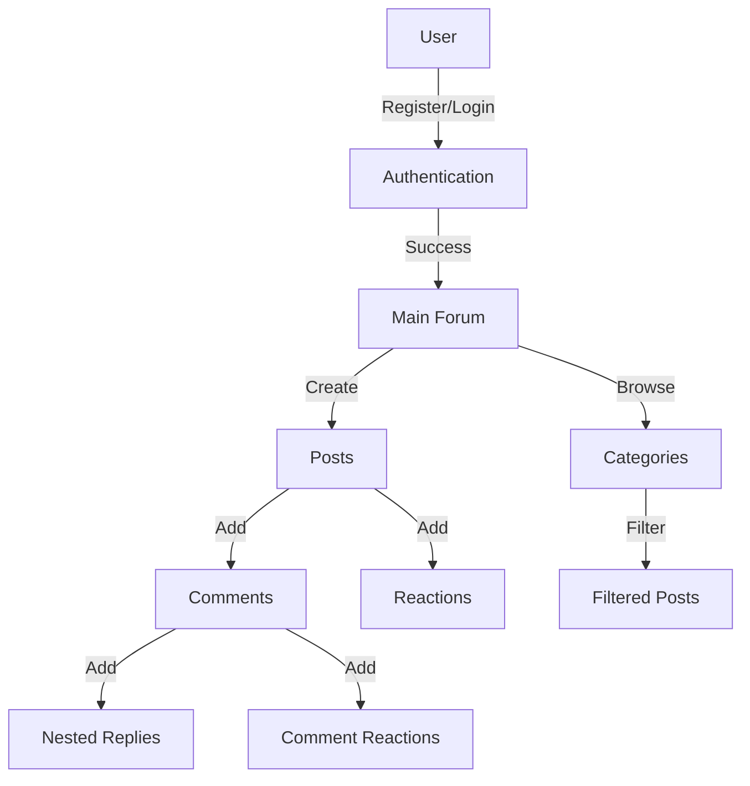

# social-media-app-authentication

[](https://go.dev/dl/
)
[](https://opensource.org/licenses/MIT)


## Table of Contents
- [Description](#description)
- [System Flow](#system-flow)
- [Features](#features)
- [Tech Stack](#tech-stack)
- [Database Structure](#database-structure)
- [Authentication](#authentication)
  - [Local Authentication](#local-authentication)
  - [Google OAuth](#google-oauth)
- [Running the Application](#running-the-application)
- [Credits](#credits)
    - [Contributors](#contributors)

## Description
A web forum application that enables user communication through posts and comments. Users can register using a `Username`, `Email`, `GitHub`, or `Google` account. After registration, they can create posts with images, comment on discussions, and engage through likes and dislikes. Posts can also be categorized and filtered for easier navigation.


## System Flow


## Features
- User authentication
  - Local registration/login
  - Google OAuth sign-in
- Post creation with categories
- Post creation with images
- Commenting system with nested replies
- Like/dislike system for posts and comments
- Post filtering by:
        - Categories
        - User's created posts
        - User's liked posts
- SQLite database for data persistence
- Session management with cookies

## Tech Stack
- Go (backend)
- SQLite (database)
- HTML/CSS/JavaScript (frontend)
- Docker (containerization)

## Database Structure
- Users (id, email, username, password)
- Posts (id, user_id, title, content)
- Comments (id, post_id, user_id, parent_id, content)
- Categories (id, name, description)
- Post reactions (likes/dislikes)
- Comment reactions (likes/dislikes)

## Authentication

### Local Authentication
Users can register and login using email/password credentials stored securely in the SQLite database.

### Google OAuth
The application supports Google OAuth 2.0 for seamless authentication. Here's how it works:

#### Flow
1. User clicks "Sign in with Google"
2. User is redirected to Google's consent screen
3. After consent, Google redirects back to our application
4. Application verifies the user's identity and creates/updates account
5. User is logged in and session is created

#### Setting Up Google OAuth
To enable Google authentication in your development environment:

1. Go to [Google Cloud Console](https://console.cloud.google.com/)
2. Create a new project or select an existing one
3. Enable the Google+ API and OAuth 2.0 APIs
4. Configure OAuth consent screen:
   - Go to "OAuth consent screen"
   - Choose "External" user type
   - Fill in required application information
   - Add necessary scopes (email, profile)

5. Create OAuth 2.0 credentials:
   - Go to "Credentials"
   - Click "Create Credentials" → "OAuth client ID"
   - Choose "Web application"
   - Add authorized redirect URIs:
     ```
     http://localhost:8080/auth/google/callback
     ```
   - Save your Client ID and Client Secret

6. Update the application configuration:
   - Set your Client ID and Client Secret in `auth/google.go`
   ```go
   var googleConfig = &GoogleConfig{
       ClientID:     "your-client-id",
       ClientSecret: "your-client-secret",
       RedirectURI:  "http://localhost:8080/auth/google/callback",
   }
   ```


## Running the Application
```bash
git clone https://learn.zone01kisumu.ke/git/hiombima/forum-authentication.git
cd forum-authentication
docker-compose build
docker run 
```

[Visit](http://localhost:8080) in your browser.

## Credits
This project was developed as part of the curriculum at 01 Founders Coding School.

### Contributors
- [Joseph Otieno](https://learn.zone01kisumu.ke/git/josotieno)
- [Bravian Nyatoro](https://learn.zone01kisumu.ke/git/bnyatoro)
- [Hilary Okello](https://learn.zone01kisumu.ke/git/hilaokello)
- [Hillary Ombima](https://learn.zone01kisumu.ke/git/hiombima)
