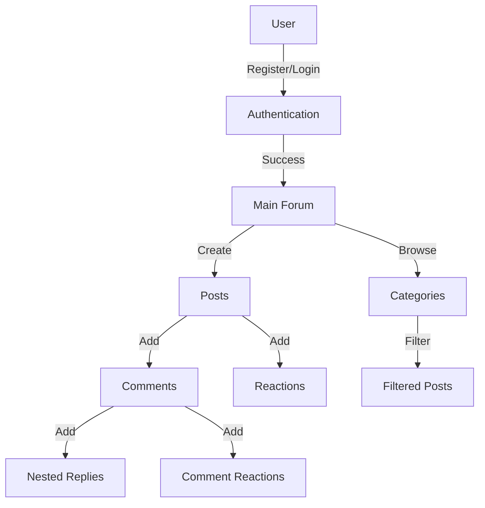

# forum-image-upload

[](https://go.dev/dl/
)
[](https://opensource.org/licenses/MIT)


## Table of Contents
- [Description](#description)
- [System Flow](#system-flow)
- [Features](#features)
- [Tech Stack](#tech-stack)
- [Database Structure](#database-structure)
- [Running the Application](#running-the-application)
- [Credits](#credits)
    - [Contributors](#contributors)

## Description
A web forum application that enables user communication through posts and comments. Users can register, create posts with images, comment, and interact through likes/dislikes. Posts can be categorized and filtered.


## System Flow


## Features
- User authentication (register/login)
- Post creation with categories
- Post creation with images
- Commenting system with nested replies
- Like/dislike system for posts and comments
- Post filtering by:
        - Categories
        - User's created posts
        - User's liked posts
- SQLite database for data persistence
- Session management with cookies

## Tech Stack
- Go (backend)
- SQLite (database)
- HTML/CSS/JavaScript (frontend)
- Docker (containerization)

## Database Structure
- Users (id, email, username, password)
- Posts (id, user_id, title, content)
- Comments (id, post_id, user_id, parent_id, content)
- Categories (id, name, description)
- Post reactions (likes/dislikes)
- Comment reactions (likes/dislikes)

## Running the Application
```bash
git clone https://learn.zone01kisumu.ke/git/hilaokello/forum-image-upload.git
cd forum
docker-compose build
docker run 
```

Visit `http://localhost:8080` in your browser.

## Credits
This project was developed as part of the curriculum at 01 Founders Coding School.

### Contributors
- [Joseph Otieno](https://learn.zone01kisumu.ke/git/josotieno)
- [Bravian Nyatoro](https://learn.zone01kisumu.ke/git/bnyatoro)
- [Hilary Okello](https://learn.zone01kisumu.ke/git/hilaokello)
- [Hillary Ombima](https://learn.zone01kisumu.ke/git/hiombima)